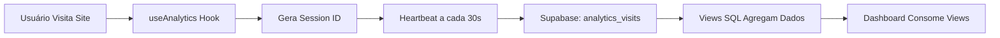

# 📊 ANALYTICS AVANÇADO - Guia de Implementação

## 🎯 O Que Foi Criado

Uma tela de **Analytics & Atribuição de Receita** no nível do **Google Analytics 4** e **Mixpanel**, focada em responder:

> **"De onde vem o dinheiro e onde ele está travando?"**

### Diferencial Profissional

Ao contrário de dashboards básicos que mostram apenas "visualizações de página", este sistema oferece:

✅ **Revenue Attribution** - Correlaciona tráfego com vendas  
✅ **Health Monitor** - KPIs com comparação percentual vs período anterior  
✅ **Funil de Conversão** - Identifica onde os usuários abandonam  
✅ **Visitantes Online** - Contador em tempo real (estilo Google Analytics)  
✅ **Breakdown por Dispositivo** - Mobile vs Desktop  
✅ **Marketing Attribution** - Qual canal de tráfego gera mais receita

---

## 🚀 Passo a Passo de Implementação

### 1️⃣ Executar o SQL no Supabase

Acesse o **SQL Editor** do Supabase e execute o arquivo:

```bash
supabase-analytics-advanced.sql
```

**O que isso cria:**

- ✅ View `marketing_attribution` - Atribuição de receita por fonte de tráfego
- ✅ View `analytics_funnel` - Funil de conversão
- ✅ View `analytics_health` - KPIs com deltas (comparação de períodos)
- ✅ View `analytics_visitors_online` - Contador de visitantes online
- ✅ Função `get_analytics_period()` - Query customizada por data
- ✅ Índices de performance

---

### 2️⃣ Ativar o Hook de Analytics

**No layout raiz da aplicação pública** (`app/layout.tsx`), adicione:

```tsx
'use client'

import { useAnalytics } from '@/lib/useAnalytics'

export default function RootLayout({ children }: { children: React.ReactNode }) {
  // ✅ Ativa rastreamento de visitantes
  useAnalytics()
  
  return (
    <html lang="pt-BR">
      <body>{children}</body>
    </html>
  )
}
```

⚠️ **Importante:** O hook NÃO rastreia páginas `/admin/*` automaticamente.

---

### 3️⃣ Acessar a Tela de Analytics

Navegue até:

```
https://seu-dominio.com/admin/analytics
```

Ou adicione um link no menu de navegação do admin.

---

## 📸 Componentes da Tela

### 🎯 Health Monitor (Topo)

4 KPIs principais com **indicadores de crescimento**:

- **Visitantes Únicos** - Total de sessões únicas (↑ 12%)
- **Taxa de Conversão Global** - % de visitantes que compraram
- **Receita Total** - R$ gerado no período
- **Ticket Médio (AOV)** - Valor médio por venda

### 📈 Gráfico Principal (Overview)

**Gráfico de Área Dupla** (Recharts):

- **Eixo Y Esquerdo** - Visitantes (linha azul)
- **Eixo Y Direito** - Vendas (linha verde)

**Insight:** Permite correlacionar picos de tráfego com vendas. Se o tráfego sobe mas as vendas não, o público é de baixa qualidade.

### 💰 Atribuição de Marketing

**Gráfico de Barras Horizontal** mostrando:

| Canal | Visitantes | Vendas | Receita | Conv. % | AOV |
|-------|-----------|--------|---------|---------|-----|
| Google | 1,000 | 15 | R$ 4.500 | 1.5% | R$ 300 |
| Instagram | 500 | 8 | R$ 2.400 | 1.6% | R$ 300 |
| Direct | 300 | 2 | R$ 600 | 0.7% | R$ 300 |

**Insight:** Mostra onde investir mais verba de marketing.

### 🔥 Funil de Conversão

Visualização em barras progressivas:

```
Visitantes      [████████████████████] 1,000 (100%)
Interessados    [████████████]          400  (40%)
Checkout        [████]                  100  (10%)
Compraram       [██]                    20   (2%)
```

**Insight:** Onde o funil "afunila" demais é onde há problema de UX/Copy.

### 👥 Visitantes Online (Realtime)

Widget com **pulse animado** mostrando:

- **Número grande** - Quantas pessoas estão no site AGORA
- **Mobile / Desktop** - Breakdown por dispositivo
- **Atualização a cada 5s** - Via polling

---

## 🔧 Como os Dados São Rastreados

### Fluxo de Analytics



### Tabela `analytics_visits`

Estrutura:

```sql
CREATE TABLE analytics_visits (
  id UUID PRIMARY KEY,
  session_id TEXT UNIQUE,
  page_path TEXT,
  last_seen TIMESTAMP,
  is_online BOOLEAN,
  user_agent TEXT,
  device_type TEXT,
  referrer_domain TEXT,
  utm_source TEXT,
  utm_medium TEXT,
  utm_campaign TEXT,
  created_at TIMESTAMP
);
```

### Exemplo de Registro

```json
{
  "session_id": "session_1737506400_abc123",
  "page_path": "/pricing",
  "last_seen": "2026-01-21T15:30:00Z",
  "is_online": true,
  "device_type": "mobile",
  "utm_source": "facebook",
  "utm_medium": "cpc",
  "utm_campaign": "lancamento-2026"
}
```

---

## 🎨 Personalizações Possíveis

### 1. Adicionar Mais Fontes de Tráfego

Edite a View `marketing_attribution` para detectar mais origens:

```sql
WHEN referrer_domain LIKE '%tiktok%' THEN 'tiktok'
WHEN referrer_domain LIKE '%twitter%' THEN 'twitter'
```

### 2. Mudar a Janela de "Online"

Por padrão, usuários são considerados online se `last_seen` for < 5 minutos.

Para mudar para 3 minutos:

```sql
-- Na view analytics_visitors_online
WHERE last_seen >= NOW() - INTERVAL '3 minutes'
```

### 3. Integrar com Google Ads / Facebook Ads

Para calcular **CAC (Custo de Aquisição)**, crie uma tabela:

```sql
CREATE TABLE ad_spend (
  date DATE,
  source TEXT,
  amount NUMERIC
);
```

Depois, na View:

```sql
SELECT 
  source,
  total_revenue,
  ad_spend.amount as cost,
  (ad_spend.amount / sales_count) as cac
FROM marketing_attribution
JOIN ad_spend USING (source)
```

---

## 🐛 Troubleshooting

### ❌ "Nenhum dado de atribuição ainda"

**Causa:** Não há registros na tabela `analytics_visits`.

**Solução:**

1. Verifique se o `useAnalytics()` está no layout raiz
2. Acesse o site público (não o /admin)
3. Aguarde 30 segundos para o primeiro heartbeat
4. Verifique no Supabase:

```sql
SELECT * FROM analytics_visits ORDER BY created_at DESC LIMIT 5;
```

---

### ❌ "Visitantes Online = 0"

**Causa:** A view `analytics_visitors_online` não está retornando dados.

**Debug:**

```sql
-- Verificar se há visitantes recentes
SELECT 
  session_id, 
  last_seen, 
  NOW() - last_seen as tempo_inativo,
  is_online
FROM analytics_visits
WHERE last_seen >= NOW() - INTERVAL '10 minutes'
ORDER BY last_seen DESC;
```

Se não aparecer nada, visite o site e aguarde o heartbeat.

---

### ❌ "Erro ao buscar visitantes online"

**Causa:** A view SQL não foi criada.

**Solução:**

Execute o SQL completo em `supabase-analytics-advanced.sql`.

---

## 📊 Exemplo de Uso Real

### Cenário: Descobrir Qual Canal Funciona

1. **Acesse** `/admin/analytics`
2. **Veja** a tabela "Detalhamento de Canais"
3. **Compare** Conv. % e Receita

**Exemplo:**

| Canal | Visitantes | Conv. % | Receita |
|-------|-----------|---------|---------|
| Google Ads | 1,000 | 0.5% | R$ 1,500 |
| Instagram Orgânico | 200 | 3.0% | R$ 1,800 |

**Insight:** Instagram converte 6x melhor! Invista mais em conteúdo orgânico.

---

### Cenário: Identificar Onde o Funil Trava

**Dados do Funil:**

- Visitantes: 1,000
- Interessados (viu pricing): 400 (40%)
- Checkout: 50 (5%)
- Compraram: 10 (1%)

**Problema:** De 400 interessados, apenas 50 iniciam o checkout (12.5%).

**Solução:** Otimizar a página de Pricing (adicionar FAQ, depoimentos, CTA mais claro).

---

## 🎉 Conclusão

Você agora tem um **sistema de analytics profissional** que:

✅ Rastreia visitantes em tempo real  
✅ Atribui receita aos canais de marketing  
✅ Mostra onde o funil de conversão trava  
✅ Compara períodos para identificar tendências  

**Próximos Passos:**

1. Executar o SQL no Supabase
2. Ativar o hook no layout
3. Adicionar UTMs nas campanhas (`?utm_source=instagram&utm_campaign=lancamento`)
4. Analisar os dados e otimizar investimentos

---

**Criado para o Gravador Médico**  
Data: 21/01/2026  
Nível: Enterprise Analytics 🚀
